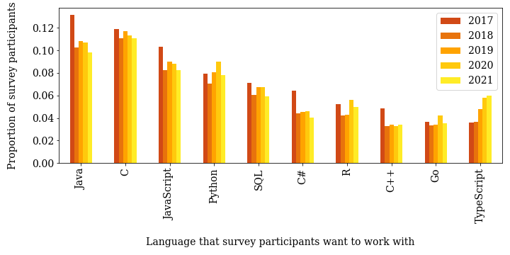
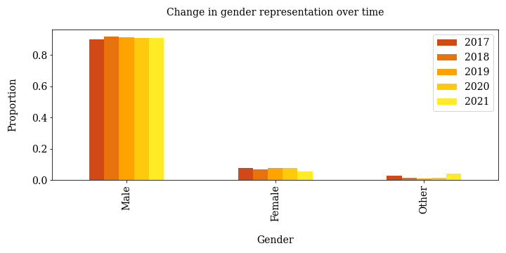

### Table of Contents

1. [Installation](#installation)
2. [Project Motivation](#motivation)
3. [File Descriptions](#files)
4. [Results](#results)
5. [Licensing, Authors, and Acknowledgements](#licensing)

## Installation 
Anaconda distribution of Python 3.0. 
Modules: numpy, pandas, matplotlib.

## Project Motivation

I was interested in analyzing yearly Stack OverFlow survey data to identify trends of interest to developers. The three questions of interest to me were:

1. How has the gender distribution of the survey participants changed between 2017 – 2021?
2. How has the racial/ethnic distribution of the survey participants changed between 2017 – 2021?
3. Which programming languages have become more or less popular between 2017 – 2021?

## File Descriptions 

This repository is associated with my [medium.com](https://medium.com/@renju.s.mathew/938aa4ac46b3) article on the subject.  

All the relevant content is in the jupyter notebook `Analysis-of-StackOverFlow-SurveyData-2017to2021.ipynb` which contains data analysis of [Stack OverFlow survey data](https://insights.stackoverflow.com/survey) for the years 2017 – 2021. 

The individual steps of the data science process (gather, assess, clean, analyze, model, visualize) are identified with Markdown cells.
CRISP-DM steps are also outlined in markdown cells at the relevant points in the notebook.

Figures generated in the notebook are saved as `Languages.png`, `Gender.png`, `Race-Ethnicity.png`, and `Top10Table.png`. These are Figures 1, 2, 3, and Table 1 respectively in the medium.com article. (These are reproduced at the bottom of this readme file.)

## Results

The results are fully discussed in the [medium.com](https://medium.com/@renju.s.mathew/938aa4ac46b3) article. 

In summary,
1. In 2017, Java was the most popular programming language and C was in second place; by 2021, C and Java have swapped positions;
2. The gender representation has remained almost the same over the five years, with a 91% male representation;
3. The race/ethnicity representation has changed over the five years, with "White or of European descent" decreasing from 71% to 53%.

## Licensing, Authors, and Acknowledgements 
Thanks to Stack OverFlow for making their data freely available at https://insights.stackoverflow.com/survey.

## Figures

  

  

  

  

